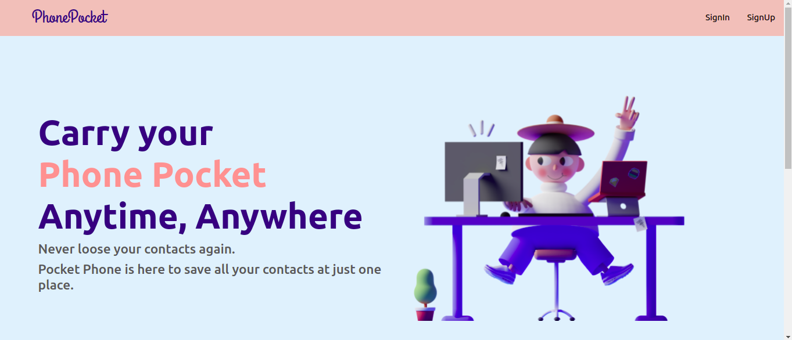
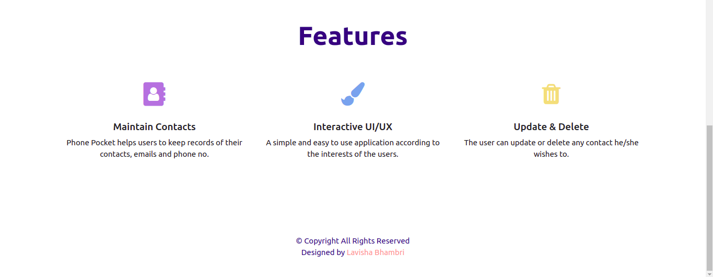
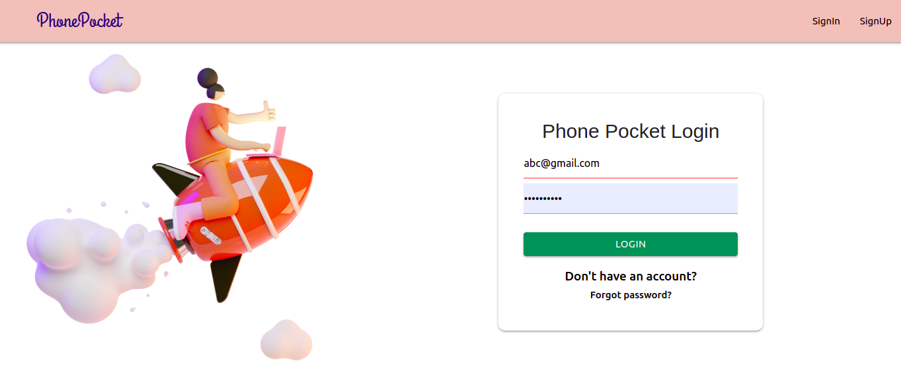
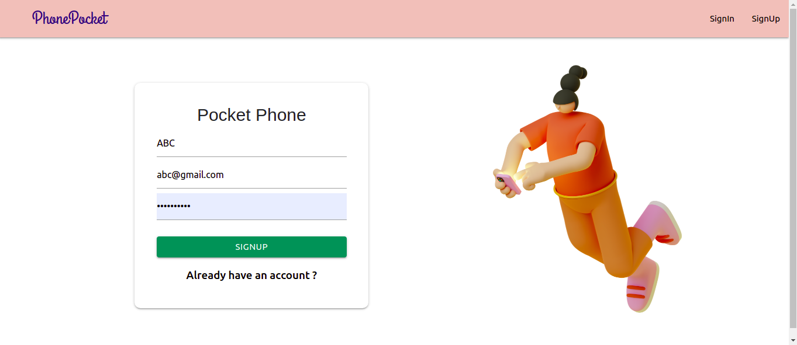
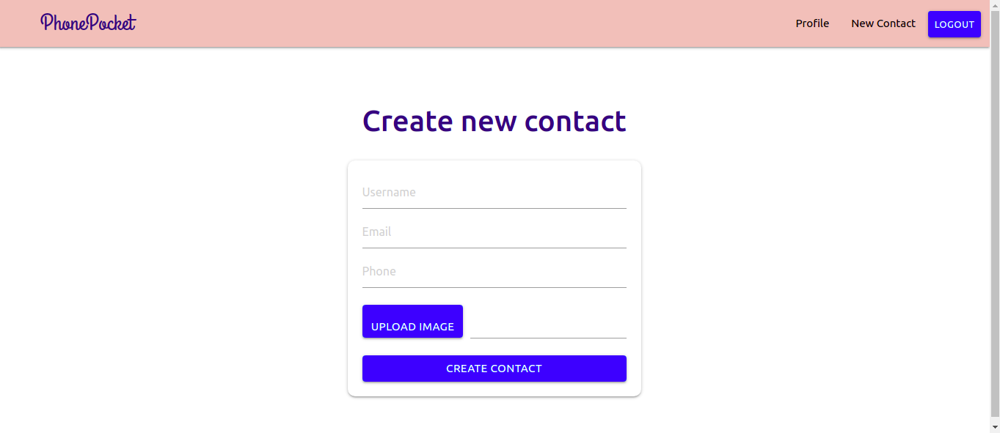
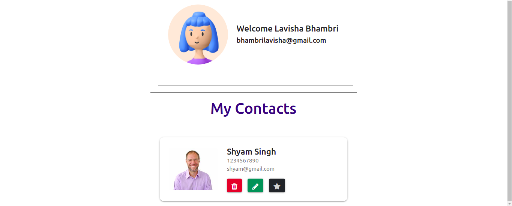

# Phone-Pocket-App 📱
- A Mernstack Web Application that allows users to maintain their contacts. It doesn't need any local storage of the user. The website can be run anywhere, either on a mobile phone or desktop.

- App Link :-
https://phone-pocket.netlify.app/

## Features
- Users can add new contacts(full name, email address, profile pic).
- Users can update or delete the pre-existing contacts.
- Simple and interactive UI/UX of the Web Application.
- Users can also favourite their contacts.

## Instructions

#### Environment Variables
- Place the API keys in `.env` with your own

## How to run?
Install dependencies
- Inside both the client and the main directories
```` 
npm install
```` 
Inside main directory
```` 
node app.js
````
Inside client
```` 
npm start
````
## Technologies used
- Frontend- HTML, CSS, Bootstrap, Flexbox, Javascript
- Backend- Node.js, Express.js
- Frameworks- React.js
- Database- MongoDB Atlas

## Snapshots of the Application
- ### Home page
<p align="center"></p><br>

- ### Features
<p align="center"></p><br>

- ### SignIn page
<p align="center"></p><br>

- ### SignUp page
<p align="center"></p><br>

- ### Create contacts page
<p align="center"></p><br>

- ### User contacts
<p align="center"></p><br>

## Hope you like it ❤️
